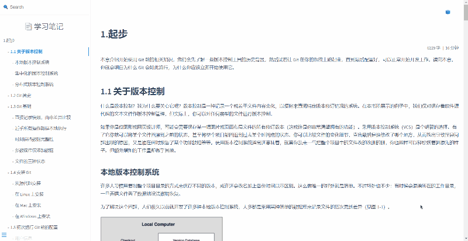

# docsify-backTop

[](https://github.com/Sumsung524/docsify-backTop/blob/master/LICENSE) [](https://github.com/Sumsung524/docsify-backTop/releases)

一个[docsify文档](https://docsify.js.org)的返回顶部插件，同时适用于其他需要添加回到顶部组件的所有页面。


演示地址：[docsify backTop Demo](https://xmq.plus/docs#/git/1.%E8%B5%B7%E6%AD%A5)



## 特征

- 组件显示隐藏
  - 页面未滚动，组件隐藏；滚动页面，显示回到顶部组件。

- 缓动动画效果
  - 回到顶部、组件显示与隐藏实现缓动动画。

- 支持自定义
  - 支持自定义调整组件大小位置、自定义图标、组件背景颜色。
- 快速安装
  - 仅需引入JS文件一行代码即可安装完成。


## 安装

jsDelivr CDN引入或本地方式引入`docsify-backTop.min.js`文件至HTML页面中：

```html
<!-- jsDelivr -->
<script src="https://cdn.jsdelivr.net/gh/Sumsung524/docsify-backTop/dist/docsify-backTop.min.js"></script>

<!-- 本地引入 -->
<script src="js/docsify-backTop.min.js"></script>
```


引入文件位置示例：

```html
<body>
    ...
	<!-- jsDelivr -->
	<script src="https://cdn.jsdelivr.net/gh/Sumsung524/docsify-backTop/dist/docsify-backTop.min.js"></script>
</body>
```

此时即可查看默认效果，如果不需要进行参数设置，那么你的安装已经结束。


## 配置参数

如果需要对回到顶部组件位置、大小、图标及背景颜色进行设置，可参考以下参数设置。

### 引入参数

可在HTML页面底部代码引入参数（按需设置，不需要设置的参数不要写入）：

```html
<script>
    docsifyBackTop = {
        size: 32,           	// 数值，组件大小，默认值32。
        bottom: 15,         	// 数值，组件底部偏移距离，默认值15。
        right: 15,          	// 数值，组件右侧偏移距离，默认值15。
        logo: '🔝',				// logo:字符串或svg矢量图代码，默认为svg代码图标。
        bgColor: '\#2096ff'    	// 背景颜色，#fff、pink等，logo为svg图标时，不填。
    };
</script>
```

具体各项参数设置详见下方"参数说明"。


引入位置示例：

```html
<body>
    ...
	<!-- 此处引入 -->
	<script>
    docsifyBackTop = {
        // ... 填入需要自定义的配置项参数
    };
	</script>
    <!-- jsDelivr -->
    <script src="https://cdn.jsdelivr.net/gh/Sumsung524/docsify-backTop/dist/docsify-backTop.min.js"></script>
</body>
```

引入位置仅供参考，只为结构合理，无明显差异。


### 参数说明

| 参数    | 参数取值                                                     | 说明                         |
| ------- | ------------------------------------------------------------ | ---------------------------- |
| size    | 数值，选填，默认值32                                         | 设置回到顶部组件大小         |
| bottom  | 数值，选填，默认值15                                         | 设置回到顶部组件底部偏移距离 |
| right   | 数值，选填，默认值15                                         | 设置回到顶部组件右侧偏移距离 |
| logo    | 字符、svg代码，内容使用单引号`''`包含，选填，默认值为sbg矢量图代码。 | 设置回到顶部组件Logo         |
| bgColor | 16进制颜色码(\#2096ff)、颜色(blue)等，内容使用单引号`''`包含，logo参数为svg图标时，不填。 | 设置回到顶部组件背景底色     |

回到顶部组件Logo中的svg代码可至[阿里巴巴矢量图库](https://www.iconfont.cn/)搜索“回到顶部”，选择自己喜欢的图标复制svg代码设置。


### 默认参数配置

默认参数配置如下，仅供参考，如需修改，仅保留修改项，其余配置项删除：

```html
<script>
    docsifyBackTop = {
        size: 32,
        bottom: 15,
        right: 15,
        logo: '<svg t="1662288563130" class="icon" viewBox="0 0 1024 1024" version="1.1" xmlns="http://www.w3.org/2000/svg" p-id="3633" width="200" height="200"><path d="M513 103.7c-226.1 0-409.4 183.3-409.4 409.4S286.9 922.6 513 922.6s409.4-183.3 409.4-409.4S739.1 103.7 513 103.7z m153.5 364.7c-5.2 5.3-12.1 7.9-19 7.9s-13.8-2.6-19-7.9L545.1 385c0 0.4 0.1 0.7 0.1 1.1V705c0 11.1-5.7 20.9-14.4 26.6-4.7 4.2-10.9 6.7-17.7 6.7-6.8 0-13-2.5-17.7-6.7-8.7-5.7-14.4-15.5-14.4-26.6V386.1c0-0.4 0-0.7 0.1-1.1l-83.4 83.4c-10.5 10.5-27.5 10.5-38 0s-10.5-27.5 0-38L494 295.9c10.5-10.5 27.5-10.5 38 0l134.5 134.5c10.5 10.4 10.5 27.5 0 38z" fill="#2096ff" p-id="3634"></path></svg>',
        bgColor: ''
    };
</script>
```

需要自定义的属性进行写入，不需要设置的参数项直接删除即可。

## 兼容性

关于低版本浏览器兼容性，可能会遇到如下问题：

- 低版本浏览器组件无显示/隐藏的过渡效果。过渡效果通过CSS3中的transition属性设置，过低版本可能无法展示过渡过程，但不影响功能。
- 含ES6新特性语法开发且未转码，可能存在低版本浏览器不兼容现象，如需在低版本浏览器考虑兼容性问题，推荐使用v1.0.0~v1.0.1版本，并且配置参数(v1.0.0~v1.0.1版本无默认配置)。


## 关于

开发细节及原理或更多设置，可下载本仓库查看`docsify-backTop.js`源码文件。
